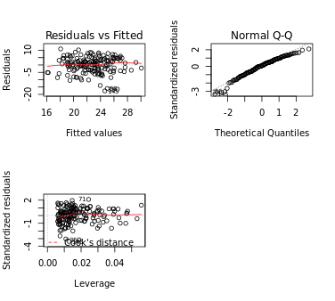

# Regression and model validation

*Describe the work you have done this week and summarize your learning.*

- Describe your work and results clearly. 
- Assume the reader has an introductory course level understanding of writing and reading R code as well as statistical methods.
- Assume the reader has no previous knowledge of your data or the more advanced methods you are using.

### part1. Know the dataset
#### Read the students2014 data
> students2014 <- read.table("http://s3.amazonaws.com/assets.datacamp.com/production/course_2218/datasets/learning2014.txt", sep=",", header=TRUE)

#### Explore the data structure and dimensions
> str(students2014)

#### Brief description to original dataset

> 
The resource data is collected from the student self evaluation survey from course **Introduction to Social Statistics, fall 2014 - in Finnish**. This survey is devided into A, B, C and D parts.
- Measures A and C are based on parts A and C in [ASSIST](http://www.etl.tla.ed.ac.uk/publications.html#measurement)
(Approaches and Study Skills Inventory for Students).
- Measures B (ASSIST B) are connected to the corresponding dimensions (Deep/SUrface/STrategic).
- Measure D is based on [SATS](http://www.evaluationandstatistics.com/) (Survey of Attitudes Toward Statistics).
- Compared to the original 52 item ASSIST we here used a brief version (created by Primi, Chiesi et al), including 32 items.

#### Brief description to student2014 dataset
> 
The student2014 dataset has 7 variables, including gender, age, attitute, deep, str, surf, and points, and 166 rows.
- gender: F (Female, 1), M (Male, 2)
- age: age in years
- attitude: Measure on the Likert scale (1-5)
- deep: Measures B for deep questions
- stra: Measures B for surface questions
- surf: Measures B for strategic questions
- points: Exam points excepted zero

### Part2. Graphical overview

#### Create an plot matrix with ggpairs()
> ggpairs(learning2014, lower = list(combo = wrap("facethist", bins = 20)))

#### Create a regression model with multiple explanatory variables
#### Choose three variables as explanatory variables and fit a regression model 
> my_model2 <- lm(points ~ attitude + stra + surf, data = learning2014)

- *hint: When there are more than one explanatory variables in the linear model, it is called multiple regression. In R, it is easy to include more than one explanatory variables in your linear model. This is done by simply defining more explanatory variables with the formula argument of lm(), as **y ~ x1 + x2 + ..** *

#### Print out a summary of the model
> summary(my_model2)

#### Brief description to student2014 dataset graphical overview
> According to the plot, we can see the correlation and distribution between each variables. For example, the top three variables relative data between points are attitude, stra and surf as 0.437, 0.146 and 0.144.

- *hint: You can use par(mfrow = c(2,2)) to build a graph with 2x2 matrix*

#### Draw diagnostic plots using the plot() function. Choose the plots 1, 2 and 5
>plot(my_model2, which = c(1,2,5), caption = list("Residuals vs Fitted", "Normal Q-Q","Residuals vs Leverage"))

- *hint: The numbers in "which = c(number1,number2,number3...)" represent different diagnostic plots, such as 1 for Residuals vs Fitted, 2 for Normal Q-Q and 5 for Residuals vs Leverage.*

#### Explain the assumptions of the model and interpret the validity of those assumptions based on the diagnostic plots
> 1. Residuals vs Fitted: This plot shows if residuals have non-linear patterns. In the my_model2 diagnostic plots above, it shows the linear pattern in this data.

> 2. Normal Q-Q: This plot shows if residuals are normally distributed. In the my_model2 diagnostic plots above, it shows the data is normally distributed.

> 3. Residuals vs Leverage: This plot helps us to find influential cases.When cases are outside of the Cook’s distance (meaning they have high Cook’s distance scores), the cases are influential to the regression results. In the my_model2 diagnostic plots above, it seems no influential outliers.

